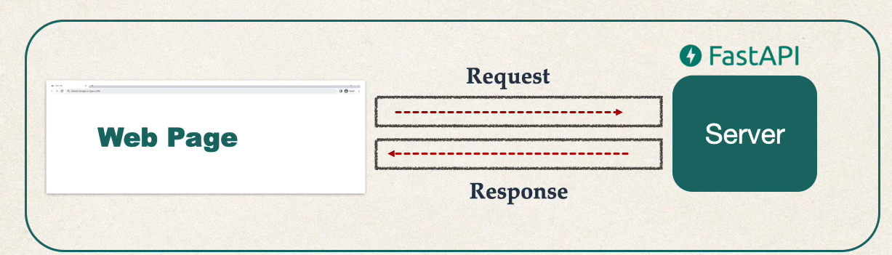
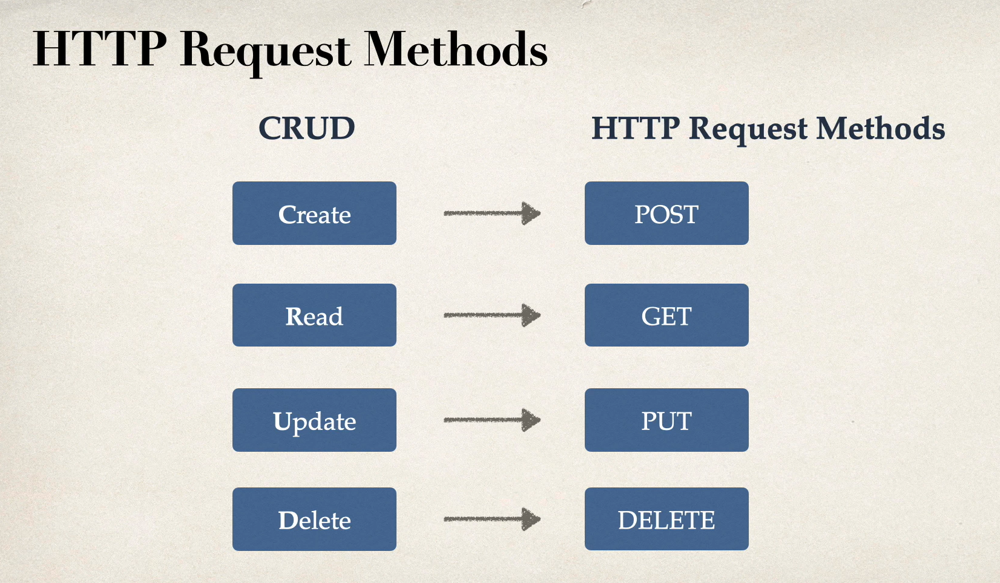

Object Oriented Programming (OOP)-is a programing paradigm based on the concepts of objects, which can contain data and code

# OOP HAS BENEFITS THAT INCLUDE:
1. Scalability (Khả năng mở rộng)
- 
2. Efficiency (Hiệu quả)
3. Reusability (Khả năng tái sử dụng)
### What are objects ?
- There are object around us in real life
- Looking out my window I see: 
- Trees
- Houses
- My dog, Milo
- All of these are real object that we could create.
## What is Abstraction ?
- Abstraction - This means to hide the implementation and only show necessary details to the user (Điều này có nghĩa là ẩn việc triển khai và chỉ hiển thị các chi tiết cần thiết cho người dùng)
- Ý nghĩa của self in python:
- ### Why use Abtraction ?
- This allows users to not have to understand what the functionality is behind scenes 
- It can simple and reusable code
- Allows for a better use of the DRY principle (Don't repeat yourself)
- Enables Python objects to become more scalable (mở rộng hơn)
### What is constructors ?
- Constructors -Are used to create and initialize an object of a class with or without starting values.
### What is a Encapsulation ?
- Encapsulation -> Bundling a data (đóng gói dữ liệu) + đóng quyết truy cập
- To ? changes our public attribites to private -> mình muốn kiểm soát việc thay đổi state trong tương lai.

- Nếu biến là public → ai cũng có thể sửa trực tiếp
->  class mất chủ động
- Nếu biến là private → sửa phải đi qua method
→ mình có “điểm chặn” để kiểm tra / validate / đổi logic bên trong mà code bên ngoài không phải sửa.

- ### Why use Encapsulation ?
- Helps keep related field and methods together
- Makes code cleaner and easier to read
- Provides more flexibility to our code
- Provides more reusability with our code  
#### getter / setter chỉ là cổng để đi vào state.
- Bản chất:
- get_val() → đọc

- set_val() → ghi (có thể chặn, validate, log, đổi behavior sau này)
- ### Tóm lại: Encapsulation là cách đóng gói dữ liệu + hành vi, để kiểm soát truy cập và giữ quyền chủ động đối với state của object.

## Fast API
- **Request and Response:** 


**API endpoint:**
- API endpoint không lưu dữ liệu.
- Nó chỉ là đường dẫn để client gửi yêu cầu đến server để tương tác với dữ liệu.

## **1. GET**
**Chức năng:** Lấy dữ liệu.
- Idempotent = “gọi lặp lại mà không thay đổi kết quả cuối cùng.”
- Không thay đổi database.
- Thường dùng để truy vấn.
- Idempotent: gọi bao nhiêu lần cũng như nhau.

**Ví dụ:**
```http
GET /users/123
```

---

## **2. POST**
**Chức năng:** Tạo mới hoặc thực hiện một hành động không-idempotent.

- Thường dùng để tạo resource mới.
- Có thể dùng để xử lý hành động như login, upload...
- Không idempotent: gọi nhiều lần sẽ tạo nhiều bản ghi hoặc thực hiện nhiều hành động.

**Ví dụ:**
```http
POST /users
{
  "name": "Hieu",
  "age": 21
}
```

---

## **3. PUT**
**Chức năng:** Cập nhật **toàn bộ** một resource.

- Thay thế toàn bộ dữ liệu cũ bằng dữ liệu mới.
- Idempotent: gọi nhiều lần kết quả vẫn như nhau.
- Không phải "thay đổi tùy ý"; đúng hơn là "replace object".

**Ví dụ:**
```http
PUT /users/123
{
  "name": "Hieu",
  "age": 22
}
```

---

## **4. PATCH**
**Chức năng:** Cập nhật **một phần** resource.

- Không cần gửi toàn bộ object.
- Cho phép thay đổi tùy ý một vài trường.
- Thường không idempotent.

**Ví dụ:**
```http
PATCH /users/123
{
  "age": 23
}
```

---

## **Tóm tắt nhanh**

| Method | Thay đổi DB? | Ý nghĩa | Idempotent? |
|--------|---------------|---------|--------------|
| **GET** | ❌ No | Lấy dữ liệu | ✔ Yes |
| **POST** | ✔ Yes | Tạo mới / hành động | ❌ No |
| **PUT** | ✔ Yes | Cập nhật toàn bộ | ✔ Yes |
| **PATCH** | ✔ Yes | Cập nhật một phần | ❌ No |

---

## **Ghi chú**
- Trong API CRUD chuẩn: `POST = Create`, `GET = Read`, `PUT/PATCH = Update`.
- `PUT = replace`, `PATCH = modify`.
- path parameter: Variables that are part of API URL
- QUERy parameter: sort and filter through  data that is  not marked by a path parameter
1. /books/author/search/        ← Cực kỳ cụ thể (3 cấp)
2. /books/author/               ← Cụ thể (2 cấp)
3. /books/{title}               ← Chung (có biến)
4. /books                       ← Chung nhất


Pydantic Field chỉ có các tham số này:
Cho STRING (str):
✅ min_length - độ dài tối thiểu
✅ max_length - độ dài tối đa
Cho NUMBER (int, float):
✅ gt - greater than (>)
✅ ge - greater or equal (≥)
✅ lt - less than (<)
✅ le - less or equal (≤)
❌ min - KHÔNG tồn tại!
❌ max - KHÔNG tồn tại!

JWT is a self-contained way to securely transmit data and information between 2 parties using a JSON Object.
JSON Web Tokens can be trusted because each JWT can be digitally signed, which in return allows the server to know if the
JWT has been changed at all.
JWT should be used when dealing with authorization.

Alembic = công cụ quản lý thay đổi cấu trúc database (schema) dành cho SQLAlchemy.
Nó giúp bạn:

thêm cột

đổi kiểu dữ liệu

rename bảng

xoá bảng

tạo quan hệ

v.v…

…mà không phải tự sửa database thủ công.
migration là cách “quản lý version” cho database schema giống như git quản lý code. Mục tiêu: database luôn đồng bộ với model code mà không mất dữ liệu.
